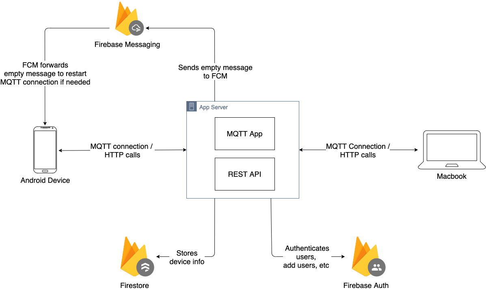

# Android Mac Connector

The Android Mac Connector project aims to bridge the connectivity between Android and Mac devices. Equipped with MQTT, you can send and read SMS, receive app notifications and take photos to your Android device from your Mac without sacrificing battery power. In addition, they can continue to remain connected even on different networks!

## Overview of the Project

This project consists of an Android app, a SwiftUI app, and a Node JS app. A video of the project can be seen below:

[](link to youtube video)

This is the system architecture of the project:



The technologies behind this project first relies on an [MQTT](https://mqtt.org/) connection to establish a two-way communication between a device and the server while guaranteeing message delivery and low power consumption. 

However, keeping an MQTT connection open is problematic for Android and Mac devices as the OS tend to terminate background services (thereby closing our MQTT connections). This is in the their effort to save battery power. Hence, the project depends on [Push Notification Services](https://en.wikipedia.org/wiki/Push_technology#Push_notification) to send updates from the server to the device, allowing us to re-establish the MQTT connection if needed. The push notification services this project currently uses is [Firebase Messaging](https://firebase.google.com/docs/cloud-messaging), which is used to send push notifications to the Android device. We are hoping to use [APNs](https://developer.apple.com/go/?id=push-notifications) to send updates to the Mac device.

In addition, this project consists of a RESTful Web Api to query the registered devices a user has. Registered devices are stored in [Firestore](https://firebase.google.com/docs/firestore).

Lastly, this project utilizes [Firebase Authentication Service](https://firebase.google.com/docs/auth) to authenticate MQTT / HTTP connections, and register new users. 

## Setup
Required programs and tools: 

* Android studio
* XCode (**no** $99 subscription needed to developer program)
* Google account

#### Setting up Firebase
1. Log into your Google Account and go to the [Firebase Console](https://console.firebase.google.com/)
2. Create a new project
3. Set up a Google Service Account and download the credentials file
4. Set up Firebase Authentication by following the steps in the console
5. Set up Firestore by following the steps in the console
6. Add a new Android app to the project
7. Add a new iOS app to the project

#### Setting up server
1. Put the credentials file in the server's root project directory (Server)
2. Export the path of the credentials file to an environment variable:

    ```
    export GOOGLE_APPLICATION_CREDENTIALS=service-account-file.json
    ```

3. [Optional] You can ignore authentication and authorization during MQTT connections by setting these environment variables:

    ```
    export VERIFY_AUTHENTICATION=false
    export VERIFY_AUTHORIZATION=false
    ```

4. Run the server by running:

    ```
    npm start
    ```

#### Setting up Android device

#### Setting up SwiftUI app

## Usage:
Please note that this project is used for educational purposes and is not intended to be used commercially. We are not liable for any damages/changes done by this project.

## Credits:

Emilio Kartono, who made the entire project

## License:

This project is protected under the GNU licence. Please refer to the Licence.txt for more information.

