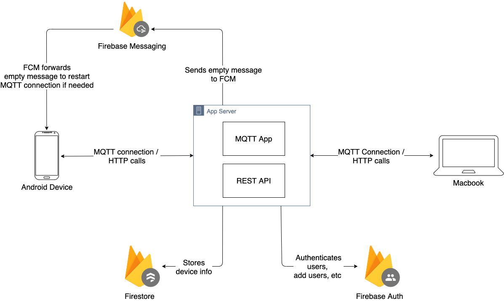

# Introduction:

Macs and IPhones have the ability to sync notifications, sms, and perform tasks seemlessly between devices through a technology called [continuity](https://support.apple.com/en-us/HT204681). However, this feature does not apply to Android phones syncing notifications to Macs. The existing solutions out there do not support devices being on a separate network, requires monthly subscriptions, and are not open source.

# Problem Statement:

We would like to build an application that would allow notifications, sms, and tasks to be shared between Mac and Android devices. The features we would like to have includes:

1. Receive sms text from my Android phone to my Mac
2. Send sms text from my Mac to my Android phone
3. See sms text from a list of contacts
4. Recieve notifications from my Android phone to my Mac
5. Reply to notifications from my Mac to my Android phone
6. Have the ability to obtain copied text (clipboard) from Android device to Mac
7. Have the ability to obtain copied text (clipboard) from Mac to Android device
8. Have the ability to open up hotspot from Android device to Mac
9. Have the ability to control the Mac's mouse from an Android device

For starters, we want features 1-5

# Proposed Solution:

There were several solutions explored:

1. Make a MacOS app that integrates with KDE Connect:
2. Make a MacOS app and Android app that uses a server:
3. Make a MacOS app and Android app that uses APN, FCM, and a server
4. Make a MacOS app, Android app, and a server, that uses FCM and long polling
5. Make a Mac Catalyst app, Android app, and a server, that uses MQTT and remote push notifications

We propose the solution to create a Mac Catalyst app, Android app, and a server that uses MQTT and remote push notifications (solution #5) because:

1. Can target different Apple devices: the Mac Catalyst app could be run on iOS, iPad, and more [(link to wiki)](https://developer.apple.com/mac-catalyst/)
2. More flexible: the devices don't have to be in the same network in order for syncing to work
3. More robust: if the devices lose connection, they can pick up the lost notifications from the MQTT server [(link)](https://internetofthingsagenda.techtarget.com/definition/MQTT-MQ-Telemetry-Transport)
4. Is cheaper: FCM (Firebase remote notifications service), Firebase Auth, and Firebase servers are initially free to try
5. Is efficient: MQTT messages use less bandwidth since they are smaller [(link)](https://internetofthingsagenda.techtarget.com/definition/MQTT-MQ-Telemetry-Transport)

This is a high-order architecture of the proposed solution:

The server will consist of an MQTT broker and a REST API. The Android device and the Macbook will subscribe to certain topics to the MQTT broker. When a device wants to notify their subscribers (ex: new SMS message), they can publish a message to a topic in the MQTT broker. The subscribers then receive the message.

Sometimes, the Android app loses connection to the MQTT broker because the device went to doze mode [(link)](https://developer.android.com/training/monitoring-device-state/doze-standby). We can wake the device by sending a remote push notification from the server to the Android device via Firebase Cloud Messaging service [(FCM)](https://firebase.google.com/docs/cloud-messaging), allowing the Android app to reconnect to the MQTT broker and receive the missing messages.

The server also consists of a REST API to handle the registration of devices. The registered devices will be stored to a [Firestore database](https://firebase.google.com/docs/firestore).

# Implementation:

1. Receiving sms text from my Android phone to my Mac:

    * To receive sms messages from my Android phone, you can create a broadcast receiver and enable READ_SMS permissions ([link](https://stackoverflow.com/questions/848728/how-can-i-read-sms-messages-from-the-device-programmatically-in-android))
    * The problem is to map the messages to the thread ID in the sms inbox, which would require doing a query of the context

2. Send sms text from my Mac to my Android phone:

    * This is possible via SmsManager ([link](https://google-developer-training.github.io/android-developer-phone-sms-course/Lesson%202/2_p_sending_sms_messages.html))

3. See sms text from a list of contacts:

    * This is possible via the context query if you have the thread id. We can get a list of thread IDs via that same context query again
    * Link: [tutorial](https://google-developer-training.github.io/android-developer-phone-sms-course/Lesson%202/2_p_sending_sms_messages.html)

4. Recieve notifications from my Android phone to my Mac:

    * This is possible via the NotificationListener service
    * Link: [tutorial](https://developer.android.com/reference/android/service/notification/NotificationListenerService)

5. Reply to notifications from my Mac to my Android phone:

    * This is possible by sending a remote input to a notification
    * Link: [tutorial](https://medium.com/@polidea/how-to-respond-to-any-messaging-notification-on-android-7befa483e2d7)

# Authentication:
We can authenticate users using [Firebase Auth](https://firebase.google.com/docs/auth), a service that handles user registration, OAuth, and user management. Each request to the Rest Api will require an OAuth token that will be verified from the server. Each connection to the MQTT broker will require the OAuth token specified in the password field of the Connect message [(link)](https://www.hivemq.com/blog/mqtt-security-fundamentals-oauth-2-0-mqtt/). Moreover, each time a device publishes or subscribes to a topic, it will verify the OAuth token.
